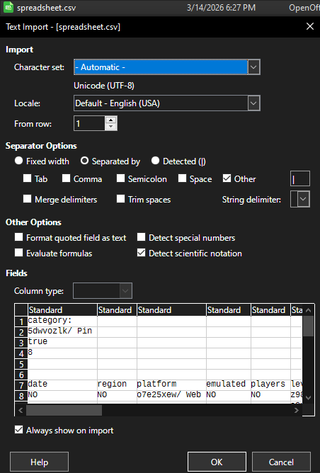
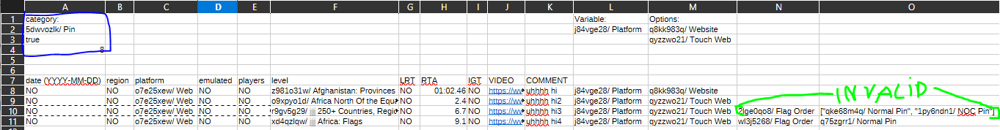
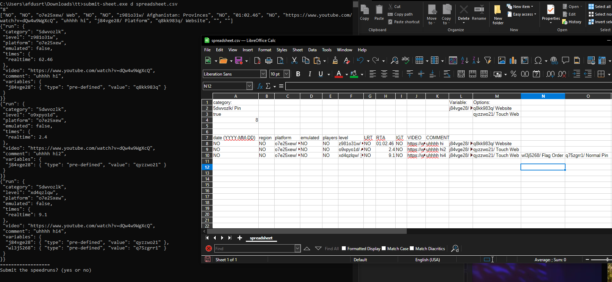

# SRCutils

Utilities for interacting with speedrun.com (for farmers, by farmers).

## Features:
   -check-updates: check for updates
   
   -fetch: fetch v2/GetUserLeaderboard data from database, into a folder.
      -arg 2: database path (database format: 1 line = 1 user id)
         -optional, default 'users.txt'
      -arg 3: output path (folder to put json output files into)
         -optional, default 'fetchGUL'

   -lb: create leaderboards txt from a folder from fetch mode, for discord bot.
      -arg 2: folder path
         -optional, default 'fetchGUL'
      -arg 3: output path (folder to put .txt leaderboards into)
         -optional, default 'leaderboards'

   -prepare-sheet: Prepares a spreadsheet, for submit sheet mode
      -arg 2: game abbreviation
      -arg 3: csv file to save
      
   -submit-sheet: Submits speedruns with data from a spreadsheet from prepare-sheet mode.
      -arg 2: api key
      -arg 3: csv file to submit
      -arg 4: sleep time between requests in ms
      
   -timestamp-sheet: timestamp runs from retime notes, from prepare-sheet.
      -arg 2: csv sheet
      -arg 3: base youtube link (that '?t=' can be added after)
         -(you can also input 'inline' to grab a video link from above the VIDEO in the video column
         -(you can also input 'replace' to grab a video link from video column itself)
      -arg 4: time field (RTALRTIGT <- string like this, eg. you can do \"LRTIGT\" for both, \"IGT\" for only igt...)
      outputs TIMESTAMPED-csv sheet.csv
      
   -resolveids: get userids from a spreadsheet that contains usernames (necessary befory submit-sheet
      -arg 2: csv sheet
      outputs RESOLVED-IDS-csv sheet.csv
      
   -uncredit: uncredit a user's runs with a filter
      -arg 2: user name of victim
      -arg 3: guest name that the victim will be forced into
      -arg 4: game abbreviation or id
      -arg 5: api key
      -arg 6: sleep in milliseconds between requests

## Usage
For this example, we will prepare and submit a spreadsheet of runs for speedrun.com/seterra.
### 1. Prepare sheet:
1. Running the command without arguments show you a help screen
```shell
HELP:
====
arg 1 - game abbreviation
arg 2 - csv file to save
```
2. Supply arguments
```shell
$ prepare-sheet.exe seterra spreadsheet.csv
```
Note: Throughout the programs runtime, you will see sections like this, these are just outputs from Curl being ran, we can ignore these. (they still get printed to show that the program didnt halt or something)
```shell
  % Total    % Received % Xferd  Average Speed   Time    Time     Time  Current
                                 Dload  Upload   Total   Spent    Left  Speed
  0     0    0     0    0     0      0      0 --:--:-- --:--:-- --:--:--     0
100   376    0   376    0     0    187      0 --:--:--  0:00:02 --:--:--   462
100 18239    0 18239    0     0   4783      0 --:--:--  0:00:03 --:--:-- 23087
```
3. The first prompt you recieve, is to choose a category.
```shell
Pick category?:
========
0/ jdz0yzv2/ Europe: Countries (with Kosovo)/ false
1/ 02qw5zp2/ The U.S.: 50 States/ false
...
9/ 5dwvozlk/ Pin/ true
...

```
The true or false statement at the end, indicates whether the category is for ILs. We will enter the index of a category to choose it. For this example we will pick 9, for the IL category Pin.
After picking a category, the categorie's variables are printed, we can ignore this if we so choose to.

4. You will now be prompted to choose the platform of your run. For games that do not have platforms, pick 0, NO.
```shell
Now, select a platform for the game: 
0/ NO
1/ o7e25xew/ Web
```
same goes for the next prompt, about regions.
NOTE: some games require regions to be set.

5. Now, the spreadsheet will be written to the file. You will see it get printed on the screen. This is for debug reasons, as if this fails, it means something went wrong before submitting.
### 2. Modify sheet:
NOTE: For this example, libreoffice calc is used.

1. Open sheet, uncheck to use anything other than '|' as a delimiter, use no string delimiter. This is important, as otherwise it would change formatting.



2. You now see the format. Do not modify A1 -> A4. Each row below the headers (date, region...) is a seperate run. Fill in all fields. Use a full video link. Do not include '"' in your comment. To choose variables, copy cells from the reference. (in this example,  the first run will set the platform variable to website, and the second run will set it to touch web). NOTE: For APIv1, you have to submit with archived variables set. In the screenshot, this spreadsheet will fail to submit, because not every row is full. you can delete rows of levels you didnt do.
3. Some variables are per level only, these are represented at the end of the row, next to the affected level. manually unwrap the value you want. (run 3, (highlighted in green), will be invalid, because we didnt unwrap our chosen value), run 4 is valid.


   
5. we are now ready for **submit-sheet** feature.
### 3. Submit sheet:
```shell
HELP:
====
arg 1 - api key, from speedrun.com -> settings -> api key
arg 2 - csv file to submit
```
```shell
submit-sheet.exe keykeykeykeykeykey spreadsheet.csv
```
Now we compare the output of the command line, where each json payload represents the run to our spreadsheet.
> **BIG NOTE:** If a game has level-specific variables, the output, will be very crowded, because of api v1 quirk, where you need to declare each level-specific variable on each level, this might get fixed some day.
If it matches up. we type "yes", and our runs will be submitted, with a limit of 1 request per 2 seconds.
 doesnt have 'watch?v=' there, this may be fixed in a later release, i guess its not hard to just check if arguments are already present.
2. 
Monitor the output after that, to see speedrun.com error codes.



**ALWAYS CHECK PENDING AFTERWARDS**

### EXTRA 1. Timestamp sheet:
1. In the spreadsheet editor, input your retime notes into COMMENT column like this:
```shell
Note: Start Time 1:18.267, End Time: 1:29.3, Frame Rate: 30, Time: 11.033
```
The script will get the times, turn the first into seconds, subtracts 1 and uses that as timestamp, then pastes the last one into the time field.
Command example:
```shell
timestamp-sheet.exe kktglm.csv https://youtu.be/tvaTwqzxfXk rta
```
*gets all times from notes, and pastes the final time into the rta column.
You can do LRTIGT, IGT... combinations like this.
NOTE: the script adds '?t=' at the end, so make sure your link
